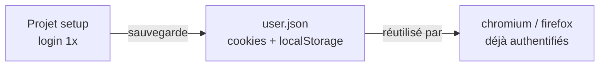

# qa-banking-automation


> Framework QA Automation — Banking context  
> Built with Playwright + TypeScript

## 🎯 Objectif

Framework d'automatisation des tests conçu pour un contexte bancaire exigeant.  
Développé comme démonstrateur technique dans le cadre d'une candidature Test Manager,  
applicable à tout SI bancaire (private banking, gestion de portefeuilles, conformité).

## 🏗️ Architecture

```
qa-banking-automation/
│
├── 📄 pages/                  # Page Object Models
│   ├── LoginPage.ts           # Page de connexion
│   └── InventoryPage.ts       # Page catalogue produits
│
├── 🔧 fixtures/               # Fixtures par rôle utilisateur
│   └── index.ts               # loginPage, inventoryPage, authenticatedPage
│
├── 🧪 tests/
│   ├── e2e/                   # Tests End-to-End UI
│   │   ├── auth.spec.ts               # 4 tests — authentification
│   │   ├── inventory.spec.ts          # 5 tests — catalogue produits
│   │   └── inventory-with-fixtures.spec.ts  # 3 tests — fixtures par rôle
│   └── api/                   # Tests API REST
│       └── bookings.spec.ts   # 6 tests — CRUD complet avec auth token
│
├── 📦 data/                   # Jeux de données de test
│   └── users.ts               # Profils utilisateurs (valide, bloqué, invalide)
│
├── 🛠️ utils/                  # Fonctions utilitaires
├── playwright.config.ts       # Configuration multi-browser, baseURL, reporters
└── .github/workflows/
    └── playwright.yml         # Pipeline CI/CD — jobs E2E et API parallèles
```

## 🧪 Couverture actuelle

| Module | Tests | Statut |
|--------|-------|--------|
| Authentification | 4 | ✅ |
| Catalogue produits | 5 | ✅ |
| Fixtures par rôle | 3 | ✅ |
| API REST (CRUD) | 6 | ✅ |
| **Total** | **18** | ✅ |

## 🚀 Lancer les tests

```bash
# Installer les dépendances
npm install
npx playwright install

# Lancer tous les tests
npx playwright test

# Lancer un module spécifique
npx playwright test tests/e2e/auth.spec.ts

# Mode headed (voir le navigateur)
npx playwright test --headed

# Rapport HTML
npx playwright show-report
```

## 🛠️ Stack technique

- **Playwright** — framework d'automatisation E2E
- **TypeScript** — typage statique
- **GitHub Actions** — CI/CD
- **Page Object Model** — pattern de maintenabilité
- **Fixtures** — gestion des rôles et contextes

## 📊 Patterns utilisés

- **Page Object Model (POM)** — séparation locators / logique / tests
- **Data-driven testing** — données de test externalisées
- **Fixtures par rôle** — authentification centralisée
- **Multi-browser** — Chromium, Firefox


## 🔐 Gestion de session — storageState

Pour optimiser le temps d'exécution, le framework utilise le pattern **`storageState`** de Playwright :

- 🔑 Un projet **`setup`** s'authentifie une seule fois et sauvegarde l'état de session (cookies + localStorage) dans `playwright/.auth/user.json`
- 🔗 Les projets **`chromium`** et **`firefox`** déclarent une dépendance sur `setup` et réutilisent cet état via `storageState`
- ⚡ Les tests démarrent donc **déjà authentifiés**, sans repasser par le flow de login à chaque fois

**Configuration (`playwright.config.ts`) :**

```typescript
projects: [
  {
    name: 'setup',
    testMatch: /.*\.setup\.ts/,
  },
  {
    name: 'chromium',
    use: {
      ...devices['Desktop Chrome'],
      storageState: 'playwright/.auth/user.json',
    },
    dependencies: ['setup'],
  },
]
```

**Flux d'exécution :**



```typescript
// playwright.config.ts
projects: [
  { name: 'setup', testMatch: /.*\.setup\.ts/ },
  {
    name: 'chromium',
    use: { storageState: 'playwright/.auth/user.json' },
    dependencies: ['setup'],
  },
]
```

```markdown

## 🧪 Couverture actuelle

| Module                  | Tests | Statut |
|--------------------------|:-----:|:------:|
| Authentification          |   4   |   ✅   |
| Catalogue produits         |   5   |   ✅   |
| Fixtures par rôle           |   3   |   ✅   |
| API REST (CRUD)            |   6   |   ✅   |
| Session storageState       |   2   |   ✅   |
| **Total**                  | **20**|  **✅**|
|
```

## 👤 Auteur

**N'Koy OTSHUDI** — QA Senior Automation Engineer  
🌐 [nkoyotshudi.fr](https://nkoyotshudi.fr)  
💻 [github.com/otshudi-n-koy](https://github.com/otshudi-n-koy)